# Görev Dağılım Yöneticisi - TaskTrack

TaskTrack işyerindeki görev yönetimini kolaylaştırmayı amaçlayan bir Flask uygulamasıdır. Kullanıcıların rolleri dahilinde görev oluşturmasına, atamasına, güncellemesine veya takip etmesine olanak tanır. Uygulama, kullanıcı kimlik doğrulama ve rol tabanlı erişim kontrolü gibi çeşitli özelliklere sahiptir.

## Temel Özellikler

### Kullanıcı Kimlik Doğrulama ve Yönetimi:

- Kullanıcılar kaydolabilir, giriş yapabilir ve profil bilgilerini güncelleyebilirler.
- Güçlü parola şifreleme (hashing) ile güvenlik sağlanmıştır.
- Giriş yapmış kullanıcılar yalnızca kendi görevlerini görebilirler.

### Görev Yönetimi:

- Kullanıcılar kendilerine atanan görevlerin durumlarını (Tamamlan, Geri Al) kontrol edebilirler.
- Görevler için son tarih belirleme özelliği bulunmaktadır (yönetici tarafından).
- Görevlerin tamamlanma durumu kullanıcı ara yüzünde gösterilmektedir.
- Kullanıcılar kendi görevlerini ve yöneticiler tüm kullanıcıların görevlerini görebilirler.

### Yönetici Paneli:

- Yönetici tüm kullanıcıların görevlerini görüntüleyebilir ve yönetebilir.
- Yeni kullanıcılar ekleyebilir ve mevcut kullanıcıları silebilir.
- Kullanıcıların görev durumlarını (Başlamadı, Devam Ediyor, Bitti) görüntüleyebilir.
- Kullanıcıların görevlerini listeleyip görev oluşturabilir, görevleri silebilir.
- Kullanıcılara görevleri için bitiş tarihi atayabilir.

### Dinamik İçerik ve Formlar:

- Bootstrap kullanılarak kullanıcı dostu bir ara yüz oluşturulmuştur.
- İnsan tarafından okunabilir tarih formatları için Humanize kütüphanesi entegre edilmiştir.

## Teknik Detaylar

### Framework ve Araçlar:

- Flask: Web uygulaması geliştirme.
- Flask-SQLAlchemy: Veritabanı yönetimi.
- Flask-Migrate: Veritabanı göçleri.
- Flask-Login: Kullanıcı oturum yönetimi.
- Werkzeug: Parola şifreleme.
- Humanize: İnsan tarafından okunabilir tarih formatları.

### Veritabanı Yapısı:

- **User**: Kullanıcı bilgilerini tutar (id, name, email, password, is_active).
- **Task**: Görev bilgilerini tutar (id, content, due_date, date_posted, user_id, completed).

### Rotalar ve Fonksiyonlar

- `/`: Ana sayfa. Kullanıcıların görevlerini listeleyen sayfa.
- `/get-tasks`: Kullanıcının görevlerini JSON formatında döndüren API.
- `/toggle-complete-task`: Görev tamamlama durumunu güncelleyen API.
- `/login`: Kullanıcı giriş sayfası.
- `/profile`: Kullanıcı profil bilgilerini güncelleme sayfası.
- `/register`: Yeni kullanıcı kayıt sayfası.
- `/admin`: Yönetici paneli. Kullanıcıların listelendiği sayfa.
- `/admin/delete-user`: Kullanıcı silme işlemi.
- `/admin/new-user`: Yeni kullanıcı ekleme sayfası.
- `/admin/user/<int:user_id>`: Belirli bir kullanıcının görevlerini görüntüleme sayfası.
- `/logout`: Kullanıcı çıkış işlemi.
- `/new-task`: Yeni görev oluşturma sayfası.
- `/delete-task`: Görev silme işlemi.
- `/errorhandler(404)`: 404 hata sayfası.
- `/errorhandler(500)`: 500 hata sayfası.

## Güvenlik ve Kullanıcı Deneyimi

- Kullanıcıların yalnızca kendi görevlerine erişim sağlayabilmesi ve yöneticilerin tüm görevleri yönetebilmesi için rol tabanlı erişim kontrolü uygulanmıştır.
- Kullanıcı deneyimini artırmak için hata mesajları ve bilgilendirme mesajları eklenmiştir.
- Güvenlik için parolalar güçlü bir şekilde hashlenmiştir.

TaskTrack işyerlerindeki görev yönetimini düzenlemek ve takip etmek için ideal bir çözümdür. Kolay kullanım ve güçlü özellikleri ile görevlerin etkin bir şekilde yönetilmesine yardımcı olur.

## Uygulama Görsel Anlatım

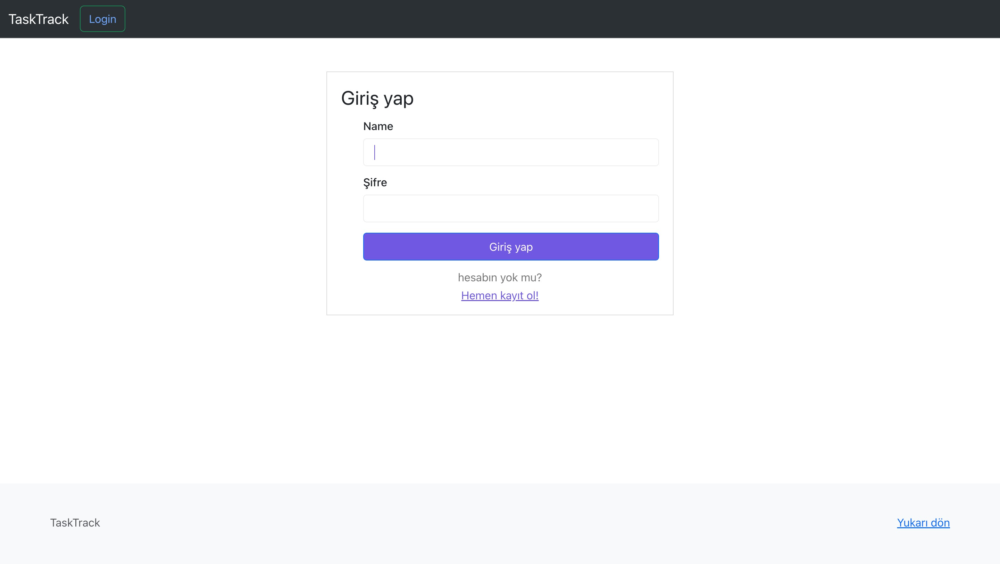
Uygulamaya giriş yaptığımızda karşımıza ilk olarak "Login" ekranı çıkıyor. Kullanıcı kayıtlı değilsek form altındaki bağlantı ile "Register" ekranına yönlendiriliyoruz.

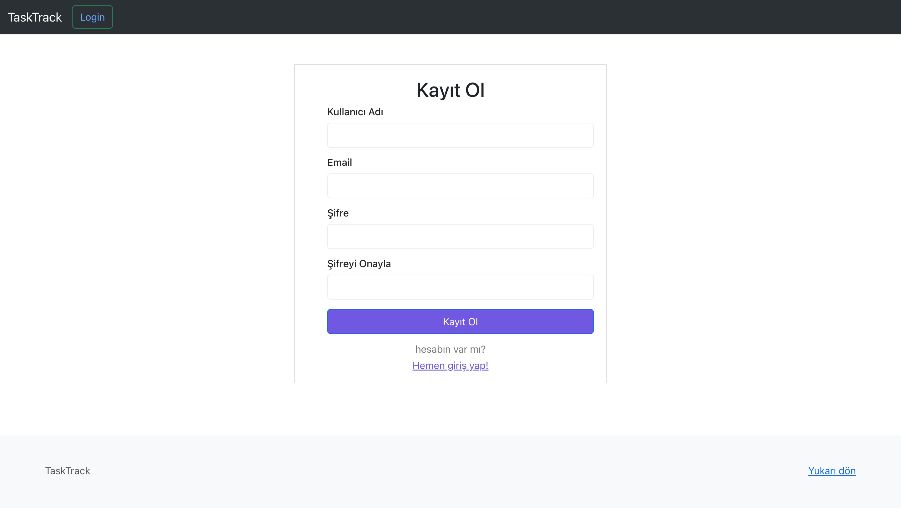
Her kullanıcı adı ve e-posta adresi benzersiz olmak zorunda.

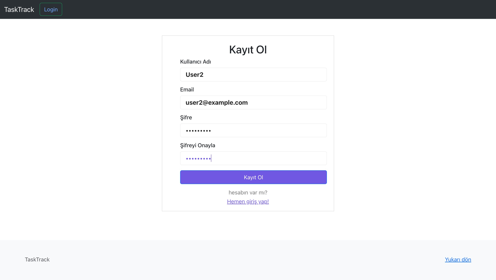
Girmiş olduğumuz kullanıcı adı ya da e-posta adresi sistemde kayıtlı ise uyarı alıyoruz.


Kayıt işlemi gerçekleştikten sonra yeniden Login sayfasına yönlendiriliyoruz.


Yönetici olmayan ve giriş yapan kullanıcıları ilk olarak ana sayfa karşılıyor. Karşımızda bizim adımıza düzenlenmiş ve sadece bizim görebileceğimiz bir yapılacaklar listesi çıkıyor, ayrıca başarılı giriş mesajını görüntülüyoruz.

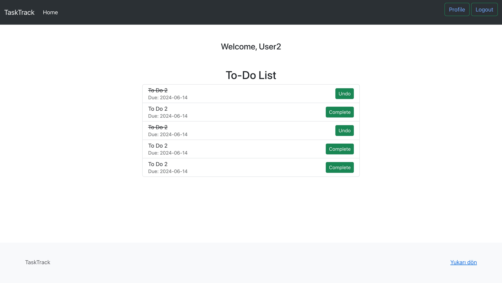
Yönetici değilsek görev ekleyemiyor ya da silemiyoruz. Sadece görevimizin durumunu değiştirebiliyoruz.

Navbar’da Home, Profile ve Logout seçeneklerini görüntülüyoruz.

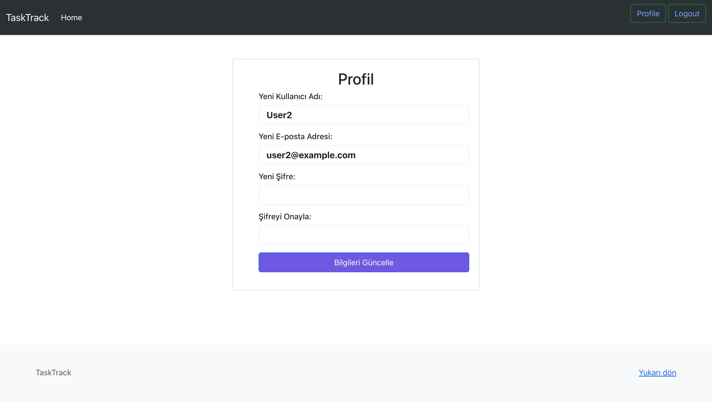
Navbar’da Profile’e tıklayınca Profil sayfamıza giriş yapmış oluyoruz. Burada kullanıcı bilgilerimizi güncelleyebiliriz. Yine bu formda da kullanıcı adı ve e-posta adresimiz benzersiz olmak zorunda. Logout’a tıkladığımızda da oturumu kapatıyoruz, karşımıza yine Login sayfası çıkıyor.

### Yönetici Ara Yüzü

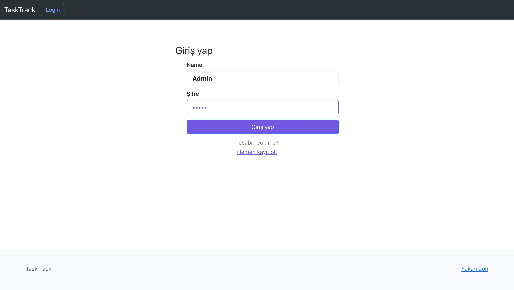
Şimdi ise Yönetici ara yüzümüze giriş yapıyoruz.

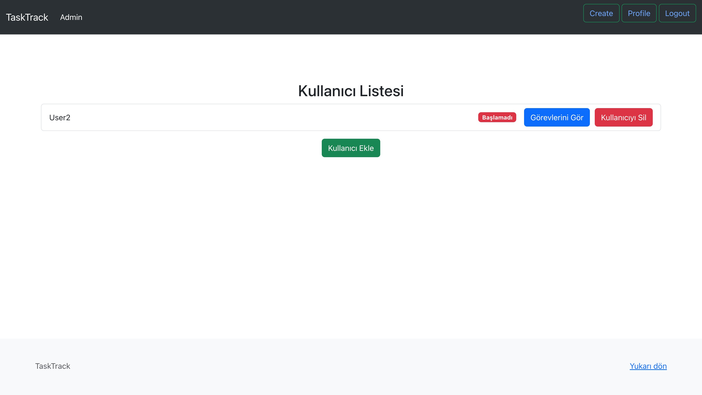
Bizi kullanıcılar listesi karşılıyor. Yönetici olarak bu listeye kullanıcı ekleme, listeden kullanıcı silme, kullanıcı görevlerini listeleme ve görev durumlarını görüntüleme gibi kontrol seçeneklerimiz var. 

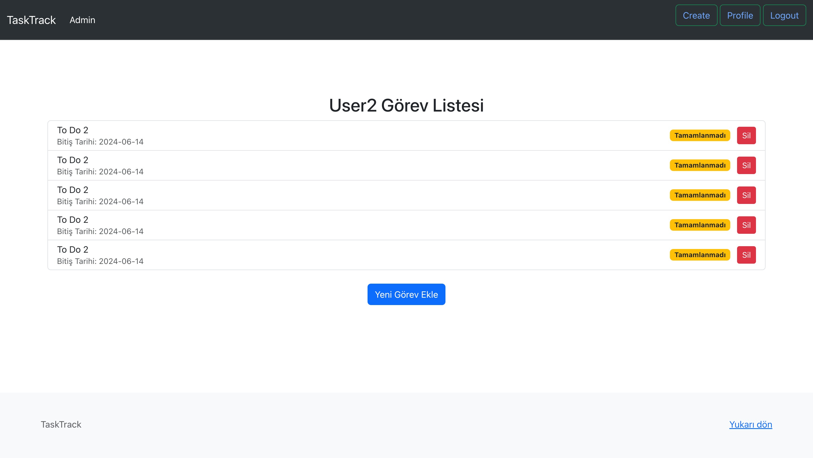
“Görevlerini Gör” butonu bizi kullanıcı sayfasına yönlendiriyor ve kullanıcının görev listesini, hangi görevler ile ilgili aksiyon aldığını gösteriyor.

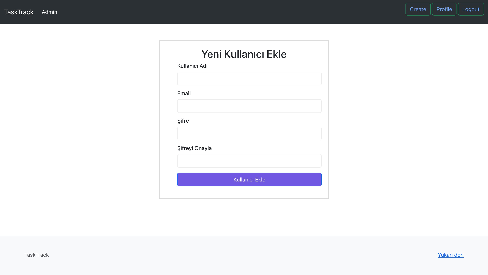
Tekrar ana sayfaya dönüş yapıp “Kullanıcı Ekle” butonuna tıkladığımızda yeni kullanıcı ekleme sayfasına yönlendiriliyoruz.

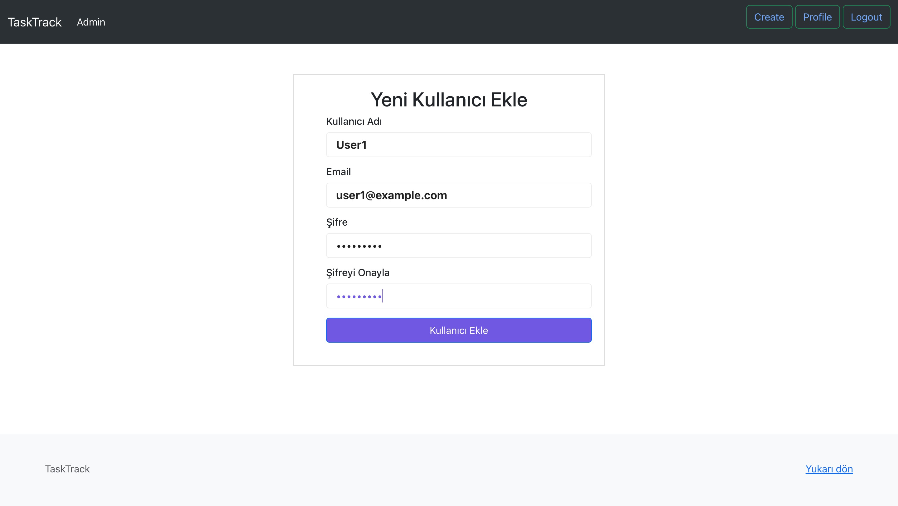
“Kullanıcı Ekle” butonuna tıkladığımızda işlemimiz başarılı ise ana sayfaya yönlendiriliyoruz.

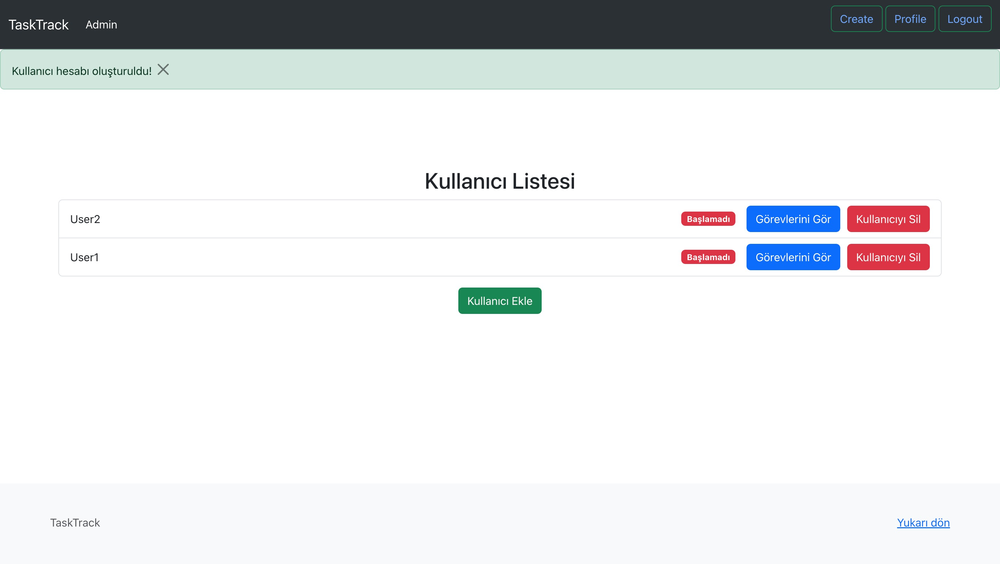
Bizi kullanıcı hesabı oluşturduğumuza dair bir mesaj ve yeni kullanıcı listesi karşılıyor.


User1‘in “Görevlerini Gör” butonuna tıklıyoruz. Henüz görev ataması yapmadığımız için boş bir sayfa ve “Yeni Görev Ekle” butonunu görüntülüyoruz.

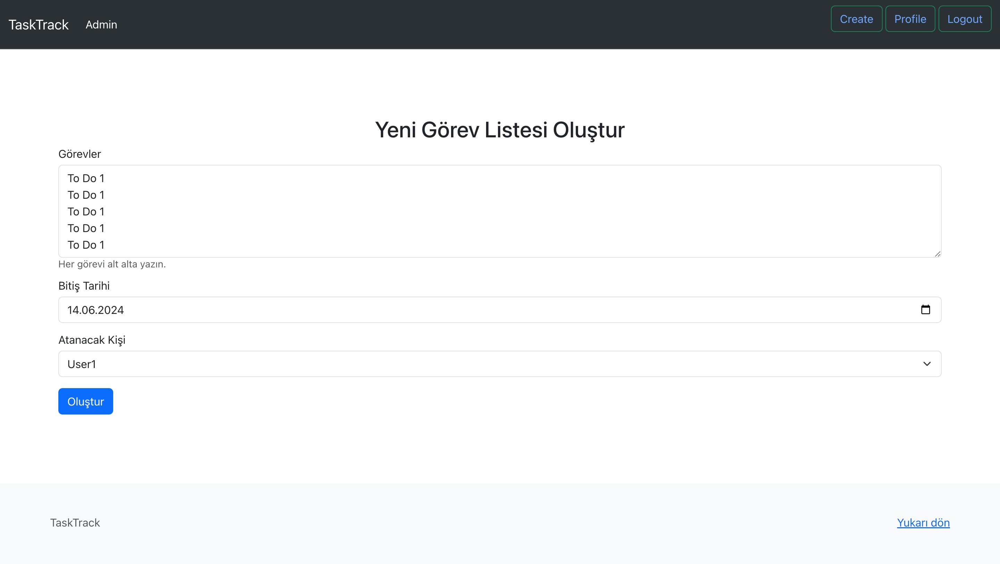
“Yeni Görev Ekle” butonunu bizi “new-task” sayfasına yönlendiriyor. Burada “Görevler” contentine görev listemizi alt alta yazıyoruz. Görev listesi için bir bitiş tarihi belirleyip görevleri atayacağımız kişiyi seçebiliyoruz; aynı özellikler Navbar alanındaki “Create”de de mevcut. Kullanıcı ayrıntılarına tıklamadan direkt olarak Navbar’dan da halledebilmemiz için eklendi.


Görev listemizi oluşturduktan sonra tekrar ana sayfaya yönlendiriliyoruz. Görevler başarıyla oluşturuldu mesajı karşılıyor bizi.


User1’in “Görevlerini Gör” butonuna tıklayınca oluşturduğumuz görev listesini ve görevlerin durumlarını görüntüleyebiliyoruz. Ayrıca burada görev silme işlemi de yapabiliyoruz.

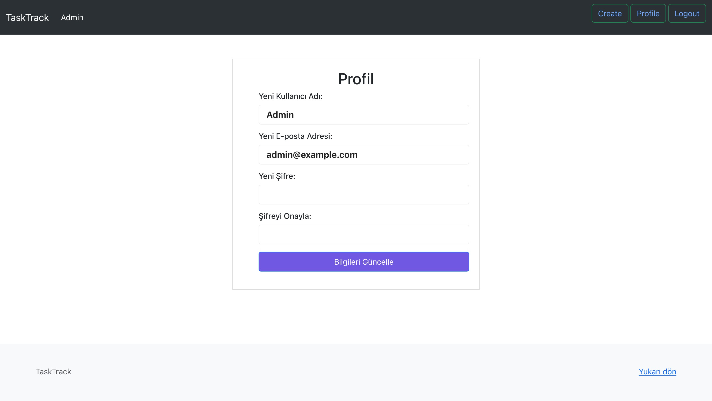
Diğer kullanıcılarda olduğu gibi Yönetici de Profil sayfasında bilgilerini güncelleyebilir.


User1 kullanıcısının sayfasına giriş yapıyoruz. Ana sayfamızda atanan yapılacaklar listesini görüntülüyoruz.

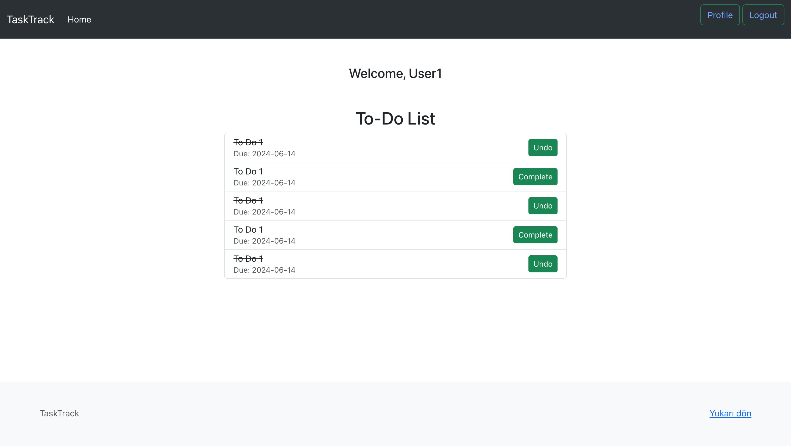
Atanan görevlerin statülerini değiştiriyoruz.

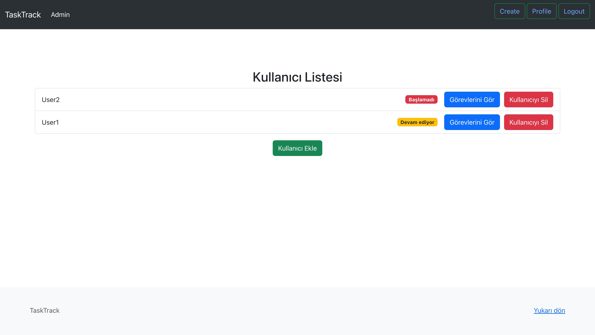
Tekrar Yönetici sayfasına döndüğümüzde User1’in statüsünün “Başlamadı”dan “Devam Ediyor”a geçtiğini görüyoruz.

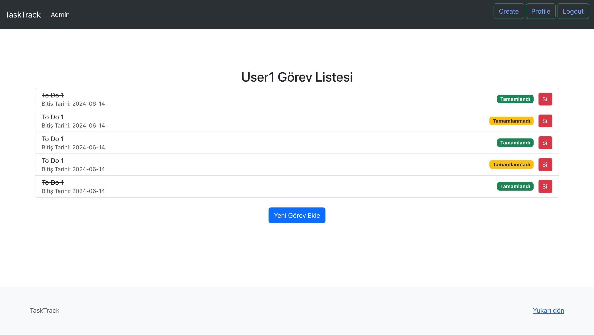
User1’in görev listesine baktığımızda ise hangi görevleri tamamlayıp hangilerini tamamlamadığını görüntülüyoruz.


User3 kullanıcısını oluşturuyoruz. Karşımıza hesap oluşturulduğuna dair mesaj çıkıyor.

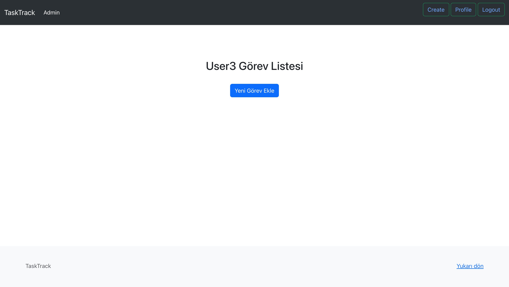
User3’ün görev listesi sayfasına giriyoruz.

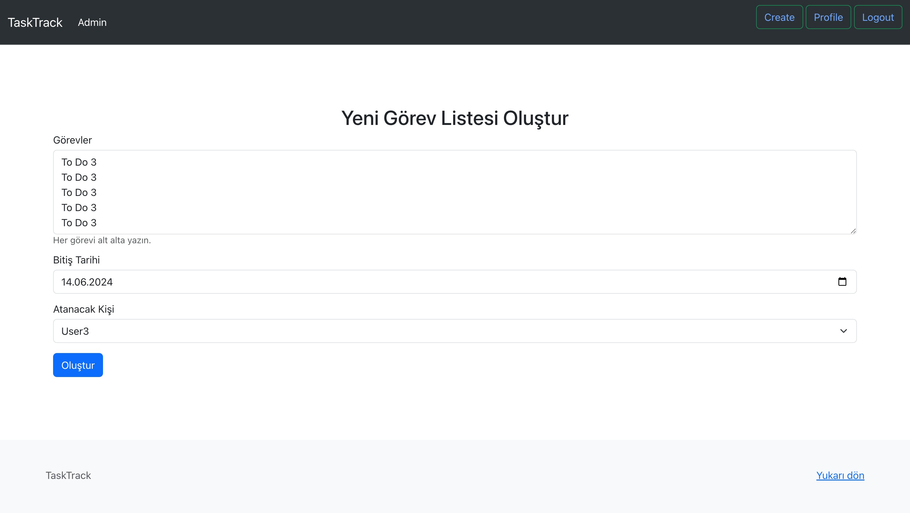
Henüz görev atanmamış kullanıcımız için görevler oluşturuyoruz.

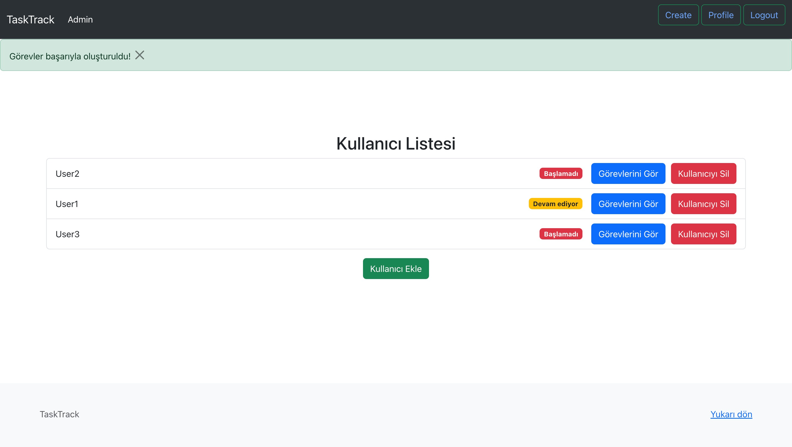
Görevleri oluşturduktan sonra Yönetici ana sayfasına yönlendiriliyoruz. Görevlerin başarıyla oluşturulduğuna dair bilgilendirme mesajı alıyoruz.


Kontrol etmek için User3 görev listesi sayfasına tekrar giriş yapıyoruz. Atadığımız görevlerin listelendiğini görüntülüyoruz.

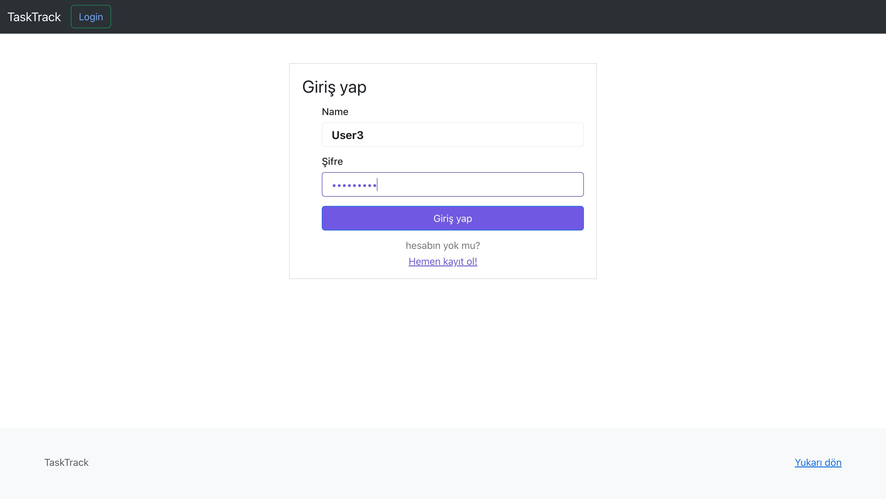
Şimdi de Yönetici sayfasından yaptığımız işlemlerin nasıl görüntülendiğini görmek için User3 kullanıcısı olarak sisteme giriş yapıyoruz.

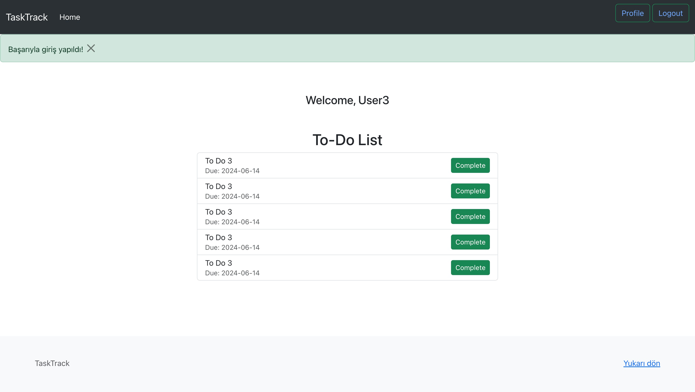
Evet, Yönetici tarafından atanan görevler ana sayfamızda listeleniyor.


User3’e atanan tüm görevlerin statülerini tamamlandı olarak değiştiriyoruz.


Ayrıca Kullanıcı olarak kendi bilgilerimizi değiştirmek istiyoruz ve Profile sayfasına giriyoruz.

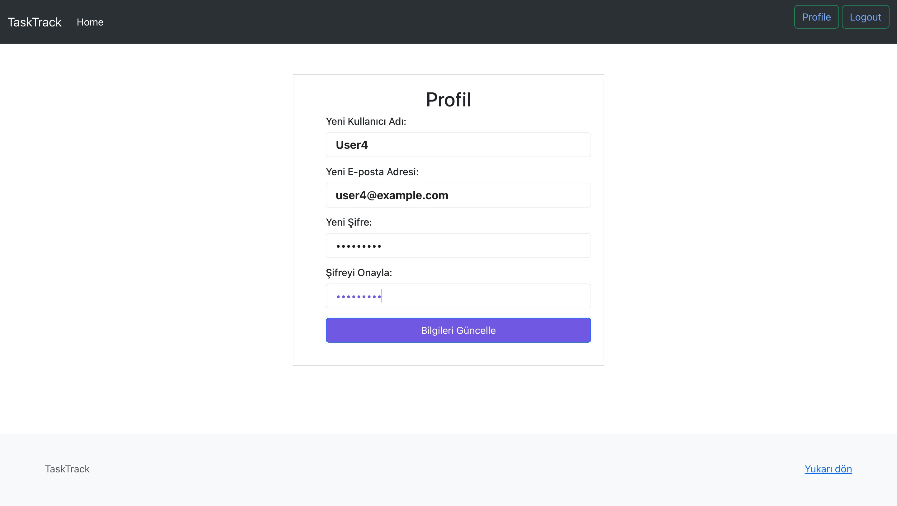
User3 olan kullanıcı adımızı User4 olarak değiştiriyoruz. Bunların dışında e-posta adresimizi ve şifremizi de güncelleyebiliriz.

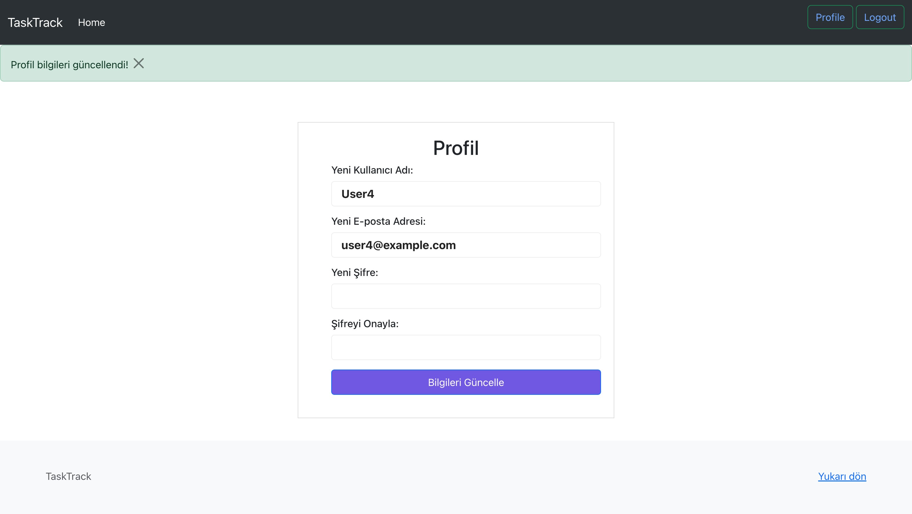
Sayfanın üstünde bilgilerimizi güncellediğimize dair mesajı görüntülüyoruz.

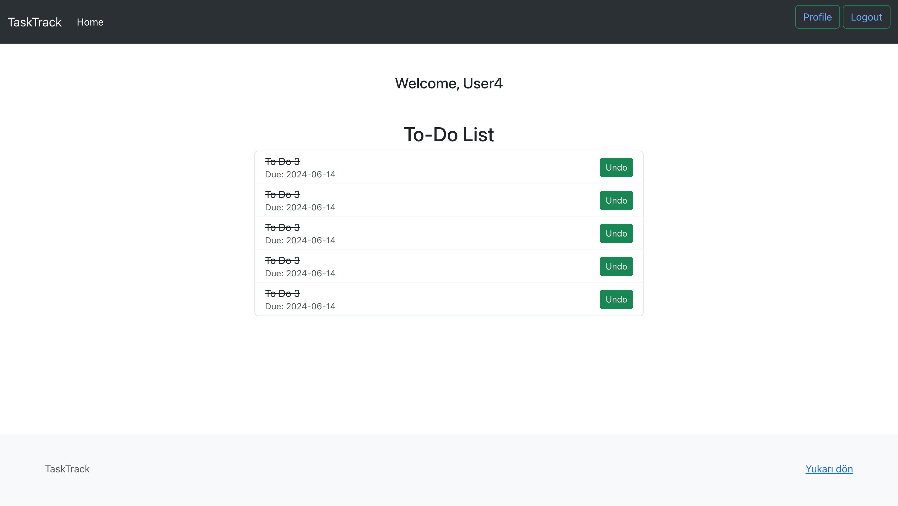
Ana Sayfamıza geri döndüğümüzde karşılama mesajında kullanıcı adımızın artık User4 olduğunu görüntülüyoruz.

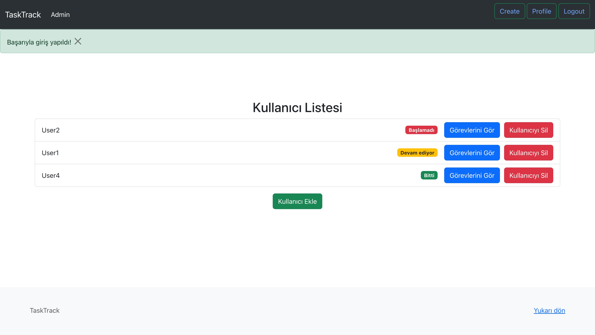
User4 kullanıcısı olarak yaptığımız değişikliklerin Yönetici sayfasına nasıl yansıdığını görüntülemek için Yönetici olarak giriş yapıyoruz. Kullanıcı listesinde kullanıcı adının User4 olarak değiştiğini ve tüm görevlerin tamamlanmış olduğunu görüntülüyoruz.

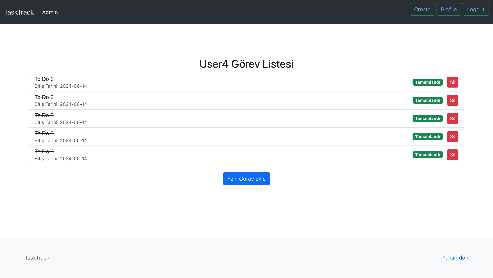
User4 Görev Listesi sayfasına geçtiğimizde görevlerin tamamlandı olarak işaretlendiğini görüntülüyoruz.


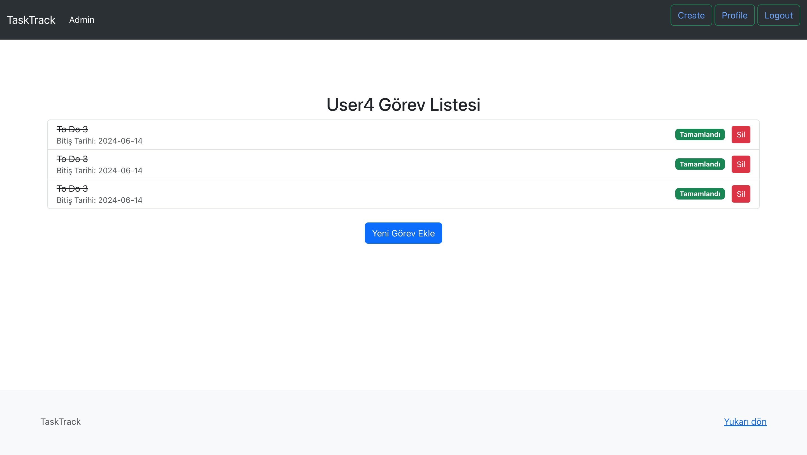
User4’ün görevlerinden birkaçını siliyoruz.

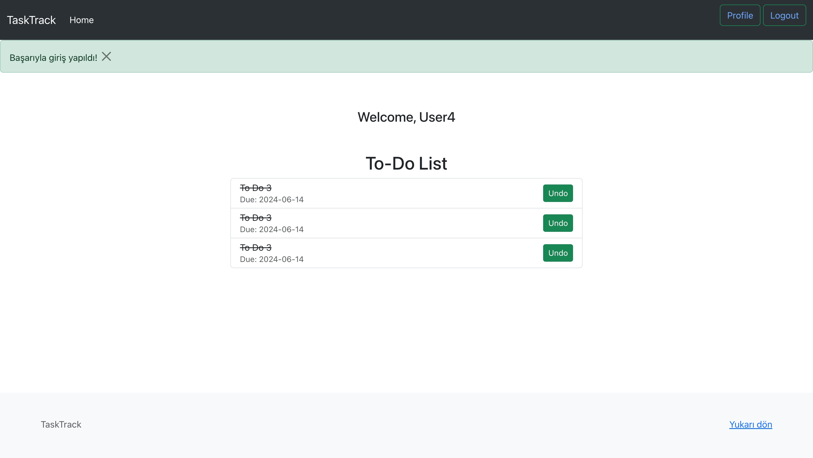
Yine User4 kullanıcısı olarak giriş yaptığımızda burada da görevlerin silinmiş olduğunu görüntüleyebiliyoruz.

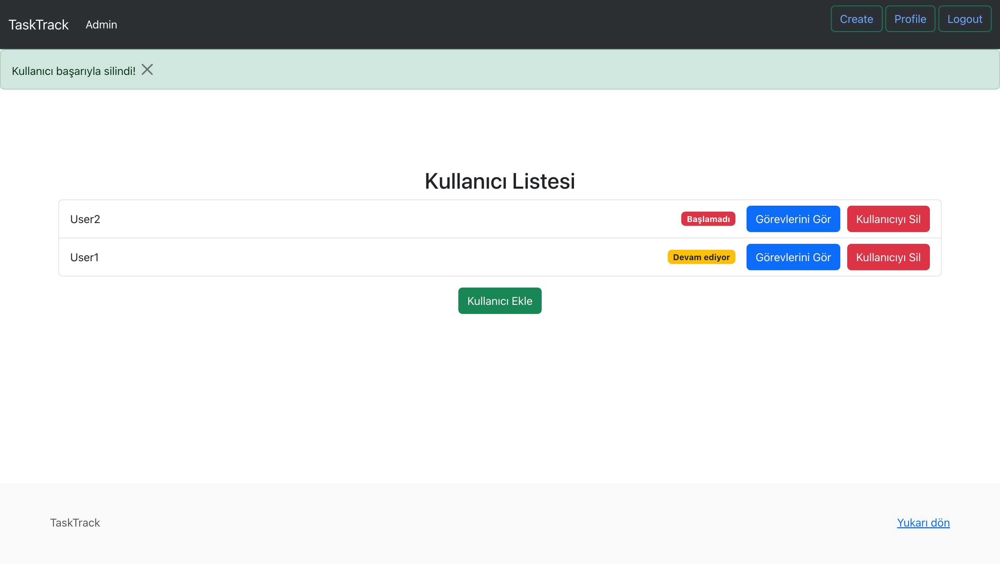
Yönetici sayfasına geri dönüp oluşturduğumuz User4 kullanıcısını siliyoruz, yine karşımıza sildiğimiz bilgisini veren mesaj çıkıyor.  Kullanıcı sildiğimizde aynı zamanda veri tabanından ilgili kullanıcıya atanan görevler de siliniyor.

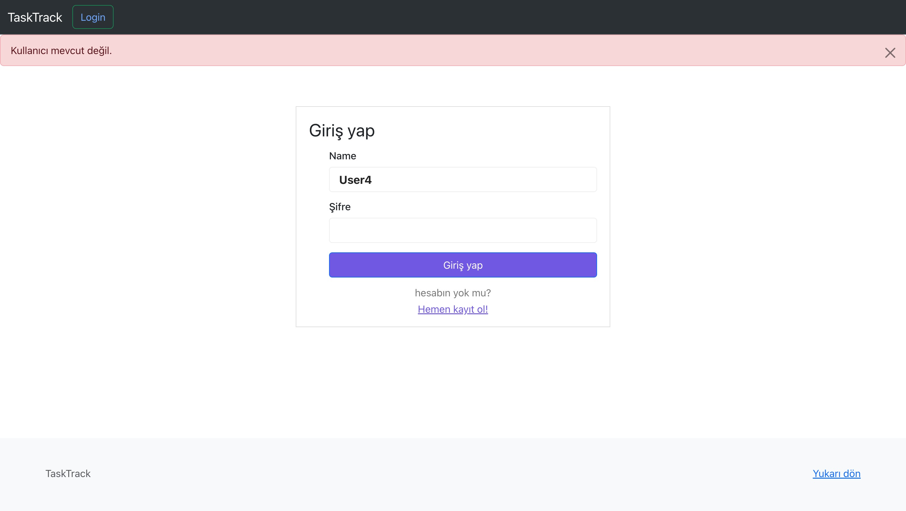
Kontrol etmek için User4 kullanıcısı olarak giriş yapmaya çalıştığımızda “Kullanıcı mevcut değil” uyarısı alıyoruz. 


404 Error sayfamız.


500 Error sayfamız.

 NOT: 500 Error sayfasını görüntüleyebilmek için aşağıdaki test kodu eklenmiştir.
 ```Python
 @app.route('/test-server-error')
 def test_server_error():
    return render_template('server_error.html'), 500 
 ```